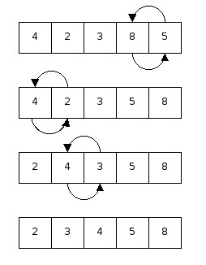

# 문제50 : 버블정렬 구현하기

[ ❓ ] 버블정렬은 두 인접한 원소를 검사하여 정렬하는 방법을 말합니다. 시간 복잡도는 느리지만 코드가 단순하기 때문에 자주 사용됩니다.



아래 코드의 빈 칸을 채워 버블 정렬을 완성해 봅시다.

```js
function bubble(arr) {
  let result = arr.slice(); 

  for (let i = 0; i < result.length - 1; i++) {
    for (/*빈칸을 채워주세요.*/) {
      if (result[j] > result[j + 1]) {
         //빈칸을 채워주세요.
      }
    }
  }
  return result;
}

const items = prompt('입력해주세요.').split(' ').map((n) => {
  return parseInt(n, 10);
});

console.log(bubble(items));
```

## 💡 내 코드
버블정렬도 잘 몰라서 한참 걸리다니... 그리구 저 이미지 이상하다구ㅠㅠ

```js
function bubble(arr) {
  let result = arr.slice(); 

  for (let i = 0; i < result.length - 1; i++) {
    for (let j = 0; j < result.length - (1 + i); j++) {
      if (result[j] > result[j + 1]) {
        result.splice(j, 2, result[j + 1], result[j]);
      } 
    }
  }
  return result;
}
```


## ✔️ 답안
```js
function bubble(arr) {
  let result = arr.slice(); // 원본 배열 복사해 새로운 배열을 반환

  // result.length - 1: 총 비교횟수는 요소개수 - 1 
  for (let i = 0; i < result.length - 1; i++) {
    // result.length - i: 바깥 반복문을 한 번 돌 때마다 끝에서부터 순서가 확정된 요소가 1개씩 늘어나게 되므로, 그 요소들을 제외하고 비교
    for (let j = 0; j < result.length - i; j++) {
      if (result[j] > result[j + 1]) {
        let temp = result[j];
        result[j] = result[j+1];
        result[j+1] = temp;
      }
    }
  }
  return result;
}
```


---
## 📓 오답 노트

1️⃣ 중첩 반복문 `for()` 를 채우는 데 시간이 걸렸다.    
이미 첫 번째 반복문에서 `result.length - 1`로 `마지막 요소 - 1`까지만 돌도록 했기 때문에 두 번째 반복문에서 1을 더할 필요 없이 `i`만 빼주면 되는 거였다. 

```
j 범위 구하기 = 0 ~ (result.length - i)

result.length = 5
i = 0 일 때, j = 0 ~ (5 - 0)
i = 1 일 때, j = 0 ~ (5 - 1)
i = 2 일 때, j = 0 ~ (5 - 2)
i = 3 일 때, j = 0 ~ (5 - 3)
i = 4 일 때, j = 0 ~ (5 - 4)
```

2️⃣ 그리고 `slice()`로 배열 복사를 했기 때문에 요소의 위치를 바꿀 때 `splice()`를 쓰지 않고 답안처럼 바로 값을 바꾸는 게 시간복잡도에서 더 유리할 것 같다. 
`splice()`도 순회가 필요한 메서드니까??! 확실한 건 아님. 근데 왠지 그럴 것 같음. 


>내가 참고한 사이트. 정리 굿
>
>https://gmlwjd9405.github.io/2018/05/06/algorithm-bubble-sort.html 


