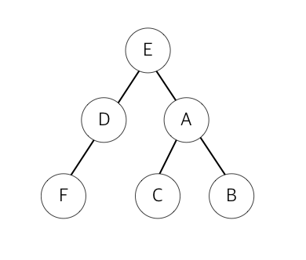

# 문제71 : 깊이 우선 탐색

[ ❓ ] 깊이 우선 탐색이란 목표한 노드를 찾기 위해 가장 우선순위가 높은 노드의 자식으로 깊이 들어갔다가 목표 노드가 존재하지 않으면 처음 방문한 노드와 연결된 다른 노드부터 그 자식 노드로 파고드는 검색 방법을 말합니다.



```
데이터
graph = {'E': ['D', 'A'],
         'F': ['D'],
         'A': ['E', 'C', 'B'],
         'B': ['A'],
         'C': ['A'],
         'D': ['E','F']}

출력
E D F A C B
```

## 💡 내 코드

바로 답안과 강의로...

## ✔️ 답안

```js
function dfs(graph, start) {
  let visited = []; // 방문 경로
  let stack = [start];

  while (stack.length !== 0) {
    let n = stack.pop();
    // 방문 여부 검사: 방문 경로에 없는 경우에만 실행
    if (!visited.includes(n)) {
      visited.push(n);
      // n이 방문 경로에 들어가면,
      // n과 연결된 하위 노드들을 스택에 쌓음(방문 여부 검사!)
      let sub = graph[n].filter((x) => !visited.includes(x));
      for (let i of sub) {
        stack.push(i);
      }
    }
  }
  return visited;
}

console.log(dfs(graph, "E"));
```

---

## ⭐ 그래프 탐색

- 하나의 정점으로부터 시작하여 차례대로 모든 정점들을 한 번씩 방문하는 것
- 예) 특정 도시에서 다른 도시로 갈 수 있는지, 전자 회로에서 특정 단자와 단자가 서로 연결되어 있는지

## ⭐ 깊이 우선 탐색(Depth-First Search)

- 루트 노드(혹은 다른 임의의 노드)에서 시작해 다음 분기(branch)로 넘어가기 전에 해당 분기를 완벽하게 탐색하는 방법
- 미로를 탐색할 때 한 방향으로 갈 수 있을 때까지 계속 가다가 더 이상 갈 수 없게 되면, 다시 가장 가까운 갈림길(분기)로 돌아와서 이곳으로부터 다른 방향으로 다시 탐색을 진행하는 방법과 유사하다.
- 즉, 넓게(wide) 탐색하기 전에 깊게(deep) 탐색하는 것이다.
- **모든 노드를 방문**하고자 하는 경우에 이 방법을 선택한다.

**특징**

- 깊이 우선 탐색이 너비 우선 탐색(BFS)보다 좀 더 간단하며, 단순 검색 속도는 BFS보다 느리다.
- 자기 자신을 호출하는 **순환 알고리즘**의 형태를 가지고 있다.
- **어떤 노드를 방문했었는지 여부를 반드시 검사**애햐 한다. 그렇지 않으면 무한 루프에 빠질 위험이 있다.

**구현 방법**

- **순환 호출** 이용
- **명시적 스택** 사용: 방문한 정점들을 스택에 저장했다가 다시 꺼내 작업한다.
  - 스택에 E가 쌓임.
  - E가 꺼내져서 방문 경로로 들어가게 되면, 그 하위 노드 A랑 D가 스택에 쌓임.
  - 스택에서 가장 위에 있는 D가 꺼내져서 방문 경로로 들어가게 되면, 그 하위 노드인 F가 스택에 쌓임.
  - F가 꺼내져서 방문 경로로 들어가면, F의 하위 노드는 없기 때문에 이전에 쌓여있던 A가 방문 경로에 들어가게 됨.
  - 위 과정 반복

**시간 복잡도**

- DFS는 그래프(정점의 수: N, 간선의 수: E)의 모든 간선을 조회한다.
  - 인접 리스트로 표현된 그래프: O(N+E)
  - 인접 행렬로 표현된 그래프: O(N^2)
