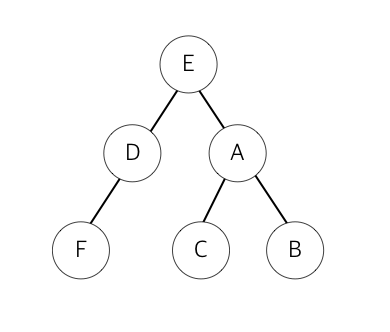

# 문제72 : 너비 우선 탐색

[ ❓ ] 너비 우선 탐색이란 어떤 노드를 방문하여 확인한 후, 목표한 노드가 아니면 그 노드와 연결된 정점들 중에서 우선순위가 동일한 다른 노드를 찾고 그 순위에 없으면 그다음 순위 노드를 차례대로 찾는 방법이다.



다음과 같이 입력이 주어질 때 너비 우선 탐색을 한 순서대로 노드의 인덱스를 공백 구분으로 출력하세요.

```
데이터
graph = {'E': ['D', 'A'],
         'F': ['D'],
         'A': ['E', 'C', 'B'],
         'B': ['A'],
         'C': ['A'],
         'D': ['E','F']}

출력
E D A F C B
```

## 💡 내 코드

바로 답안과 강의로...

## ✔️ 답안

```js
const graph = {
  A: ["E", "C", "B"],
  B: ["A"],
  C: ["A"],
  D: ["E", "F"],
  E: ["D", "A"],
  F: ["D"],
};

function bfs(graph, start) {
  let visited = [];
  let queue = [start];

  while (queue.length !== 0) {
    // 큐에서 가장 앞의 노드를 꺼냄 
    let n = queue.shift();
    if (!visited.includes(n)) {
      visited.push(n);
      let sub = graph[n].filter((x) => !visited.includes(x));
      for (let i of sub) {
        queue.push(i);
      }
    }
  }
  return visited;
}

console.log(bfs(graph, "E"));
```

---

## ⭐ 그래프 탐색

- 하나의 정점으로부터 시작하여 차례대로 모든 정점들을 한 번씩 방문하는 것
- 예) 특정 도시에서 다른 도시로 갈 수 있는지, 전자 회로에서 특정 단자와 단자가 서로 연결되어 있는지

## ⭐ 너비 우선 탐색(Breadth-First Search)

- 루트 노드(혹은 다른 임의의 노드)에서 시작해 **인접한 노드를 먼저 탐색**하는 방법
- 시작 정점으로부터 가까운 정점을 먼저 방문하고, 멀리 떨어져있는 정점을 나중에 방문하는 순회 방법이다.
- 즉, 깊게(deep) 탐색하기 전에 넓게(wide) 탐색하는 것이다.
- **두 노드 사이의 최단 경로** 혹은 **임의의 경로**를 찾고자 하는 경우에 이 방법을 선택한다.
  - 예) 지구상에 존재하는 모든 친구 관계를 그래프로 표현한 후, A와 B 사이에 존재하는 경로를 찾는 경우
  - 깊이 우선 탐색: 모든 친구 관계를 다 살펴봐야할 수도 있다.
  - 너비 우선 탐색: A와 가까운 관계부터 탐색한다.

**특징**

- 너비 우선 탐색이 깊이 우선 탐색보다 좀 더 복잡하다.
- 직관적이지 않은 면이 있다.
  - BFS는 시작 노드에서 시작해, 거리에 따라 단계별로 탐색한다고 볼 수 있다.
- **재귀적으로 동작하지 않는다.**
- **어떤 노드를 방문했었는지 여부를 반드시 검사**애햐 한다. 그렇지 않으면 무한 루프에 빠질 위험이 있다.
- Prim, Dijkstra 알고리즘과 유사하다.

**구현 방법**

- **큐(Queue)** 를 사용: **선입선출(FIFO)** 원칙으로 탐색한다.
  - 큐에 E가 쌓임.
  - E가 꺼내져서 방문 경로로 들어가게 되면, 그 하위 노드 D랑 A가 큐에 쌓임. (A - D)
  - 큐에서 가장 앞에 있는 D가 꺼내져서 방문 경로로 들어가게 되면, 그 하위 노드인 F가 큐에 쌓임. (F - A)
  - 큐에서 가장 앞에 있는 A가 꺼내져서 방문 경로로 들어가면, A의 하위 노드인 C랑 B가 큐에 쌓임. (B - C - F)
  - 앞 F 노드에서부터 차례대로 방문 경로로 들어감. 이 때 연결된 하위 노드들은 없기 때문에 큐에 쌓이는 노드도 없음.

**시간 복잡도**

- 인접 리스트로 표현된 그래프: O(N+E)
- 인접 행렬로 표현된 그래프: O(N^2)
