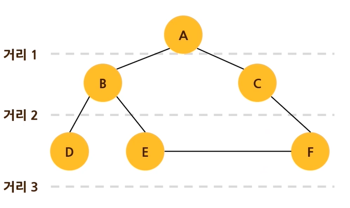

# 문제73 : 최단 경로 찾기

[ ❓ ] 다음과 같이 노드의 연결 관계가 리스트 형태로 주어집니다. 그다음 경로를 구할 두 정점이 공백으로 구분되어 주어질 것입니다.

두 정점 사이를 이동할 수 있는 최단 거리를 출력하는 프로그램을 작성해 주세요.

이때 최단 거리란, 정점의 중복 없이 한 정점에서 다른 정점까지 갈 수 있는 가장 적은 간선의 수를 의미합니다.

```
데이터
graph = {'A': ['B', 'C'],
         'B': ['A', 'D', 'E'],
         'C': ['A', 'F'],
         'D': ['B'],
         'E': ['B', 'F'],
         'F': ['C', 'E']}

입력
A F

출력
2
```



## 💡 내 코드

나는 F까지 가는 횟수를 찾은거지 이건 최단 거리가 아니쟈나ㅠㅠ

```js
const nodes = 'A F'.split(' ');

const bfs = (graph, nodes) => {
  const visited = [];
  let queue = [nodes[0]];
  let count = 0;

  while (queue.length > 0) {
    const n = queue.shift();
    if (!visited.includes(n)) {
      visited.push(n);
      if (n === nodes[1]) {
        console.log(`visited: ${visited}`);
        queue = [];
      } else {
        const sub = graph[n].filter((g) => !visited.includes(g));
        for (let s of sub) {
          queue.push(s);
        }
        count++;
      }
    }
  }
  return count;
};

console.log(bfs(graph, nodes));
```

## ✔️ 답안

```js
const user_input = prompt('입력해주세요').split(' ');
const start = user_input[0];
const end = user_input[1];

// 처음에 시작 노드를 담아둬야 while문에 진입할 수 있다
let queue = [start];
let visited = [start];

function solution() {
  // 노드 A에서 시작하는 순간 count가 1이 되야하므로
  // 처음엔 -1로 시작
  let count = -1;

  while (queue.length !== 0) {
    // 큐 순회문 바깥에서 카운트를 해줘야
    // 거리1, 거리2마다 한 번씩만 카운트가 된다
    count += 1;

    let size = queue.length;

    // 큐의 사이즈만큼 순회
    for (let i = 0; i < size; i++) {
      // 큐에서 첫번째 노드 꺼냄
      let node = queue.splice(0, 1);

      // 꺼낸 노드가 종료 노드와 같다면 멈춤
      if (node == end) {
        return count;
      }

      // for...in: 요소의 값이 아닌 인덱스로
      for (let next_node in graph[node]) {
        if (!visited.includes(graph[node][next_node])) {
          visited.push(graph[node][next_node]);
          queue.push(graph[node][next_node]);
        }
      }
    }
  }
}
console.log(solution());
```

---

## 📌 추가

내 기준 더 알아보기 쉽게 변경한 코드.
근데 왜 방문경로랑 큐에 같이 푸시하는지 잘 이해가 안감.

```js
const bfs = (graph, nodes) => {
  const visited = [nodes[0]];
  const queue = [nodes[0]];
  let count = -1;

  while (queue.length > 0) {
    count++;
    for (let i = 0; i < queue.length; i++) {
      const n = queue.shift();
      if (n === nodes[1]) {
        return count;
      }
      const sub = graph[n].filter((g) => !visited.includes(g));
      for (let s of sub) {
        visited.push(s);
        queue.push(s);
      }
    }
  }
  return count;
};
```
