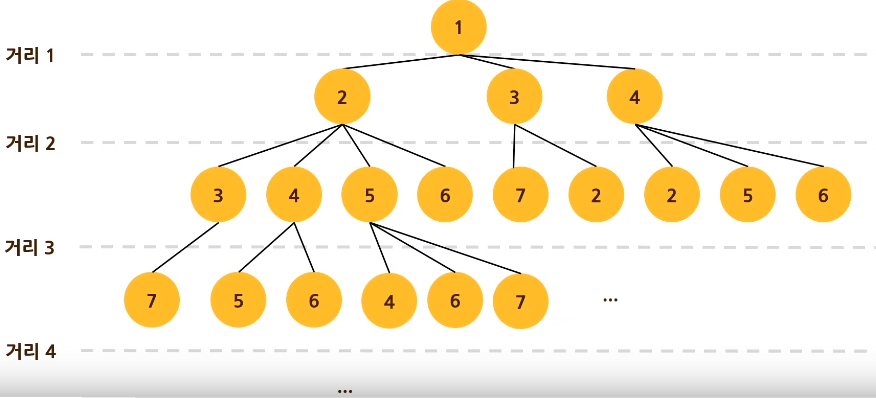

# 문제74 : 최장 경로 찾기

[ ❓ ] 다음과 같이 노드의 연결 관계가 주어집니다.
입력으로는 경로를 구할 두 정점의 번호가 공백으로 구분되어 주어집니다.
우리는 이 두 정점으로 가기 위한 최대 거리를 구하고자 합니다.

최대 거리란, 정점의 중복 없이 한 정점에서 다른 정점까지 경유할 수 있는 가장 많은 간선의 수를 뜻합니다.

```
데이터
graph = {1: [2, 3, 4],
		2: [1, 3, 4, 5, 6],
		3: [1, 2, 7],
		4: [1, 2, 5, 6],
		5: [2, 4, 6, 7],
		6: [2, 4, 5, 7],
		7: [3, 5, 6]}

입력
1 7

출력
6
```



## 💡 내 코드

dfs인줄 알았는데 bfs로 푸는 거였넼ㅋㅋㅋㅋ

```js
const nodes = '1 7'.split(' ');

function dfs(graph) {
  const visited = [nodes[0]];
  const stack = [nodes[0]];
  let count = -1;

  while (stack.length > 0) {
    for (let i = 0; i < stack.length; i++) {
      count++;
      const n = stack.pop();
      if (n === nodes[1]) {
        return count;
      }
      const sub = graph[n].filter((g) => !visited.includes(g));
      for (let s of sub) {
        visited.push(s);
        stack.push(s);
      }
    }
  }
  return count;
}

console.log(dfs(graph));
```

## ✔️ 답안

- 방문한 노드를 누적해가면서, 누적된 노드들의 길이를 비교해 가장 큰 값을 반환하는 알고리즘!
- 최대값 알고리즘, 다이나믹 알고리즘

```js
const user_input = prompt('입력해주세요').split(' ');
const start = parseInt(user_input[0], 10);
const end = parseInt(user_input[1], 10);

let queue = [start];
let visited = []; // 얜 또 왜 빈 배열이냐...

function sol(n, visited) {
  let node = n[n.length - 1]; // 큐의 마지막 요소
  let length = 0;

  if (node == end) {
    return visited.length;
  }

  if (visited.includes(node)) {
    // ha...
    return visited.length;
  } else {
    visited.push(node);
  }
  let max = [];

  for (let next_node in graph[node]) {
    n.push(graph[node][next_node]);

    max.push(length, sol(n, visited)); // 재귀호출
    length = Math.max.apply(null, max); // 최대값을 담아서 리턴

    // n.pop()과 같음(참조값은 주소를 전달하므로)
    // 왜 큐를 팝을 해?!!!!
    queue.pop();
  }
  return length;
}

console.log(sol(queue, visited));
```
